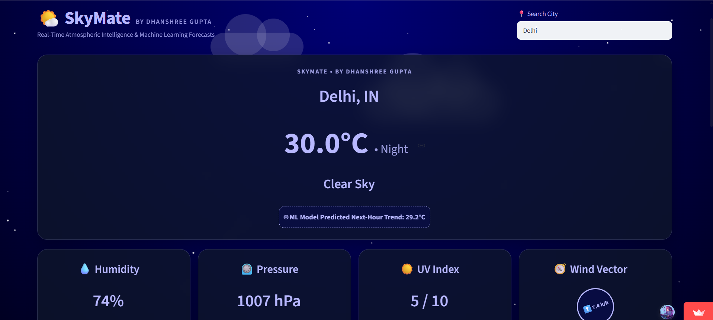
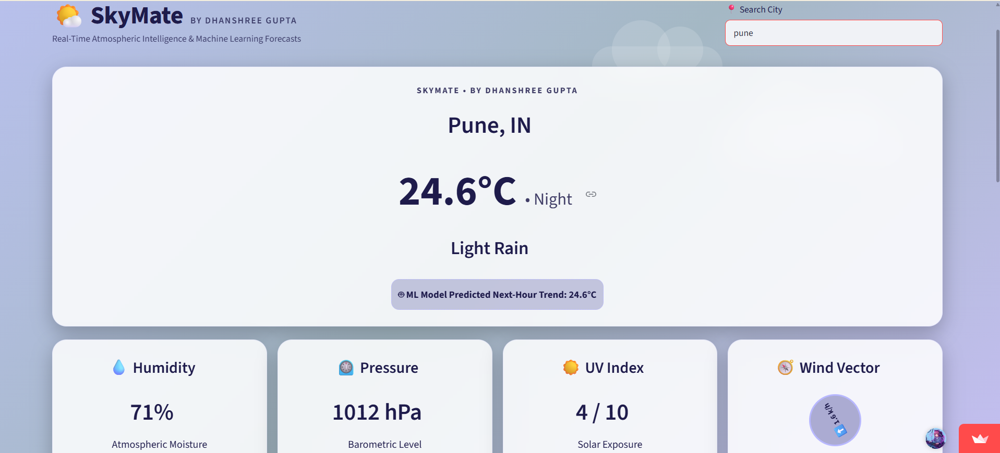
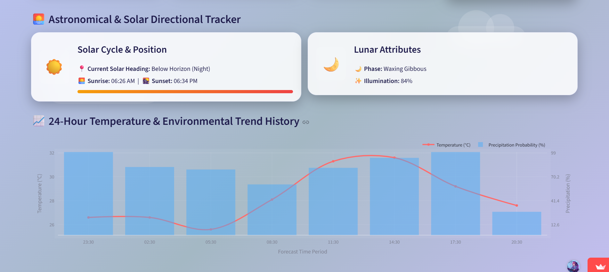
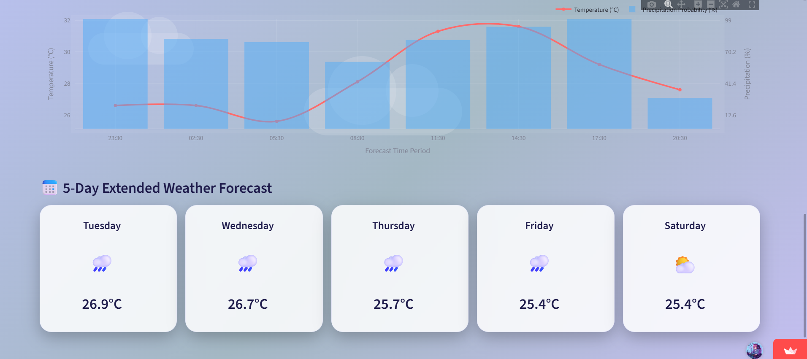

# 🌤️ SkyMate — Real-Time Climate Intelligence & Weather Prediction System

> **SkyMate** is a real-time atmospheric intelligence dashboard developed by **Dhanshree Gupta**. It combines live weather metrics from OpenWeatherMap with a trained Machine Learning model to forecast temperature trends, display astronomical conditions, and provide a 5-day weather forecast.

---

## 📸 App Interface & Screenshots

Here is a look at the SkyMate application in action:

### 1. Main Weather Dashboard & Real-Time Metrics


### 2. Astronomical & Solar Tracker


### 3. 24-Hour Temperature & Environmental Trend History


### 4. 5-Day Extended Weather Forecast


---

## 🧠 How the Project is Made

SkyMate operates through a multi-tier pipeline integrating real-time API polling, machine learning inference, and dynamic UI rendering:

1. **User Input Sanitization:** User city entries are cleaned (`.strip()`) and URL-encoded (`urllib.parse.quote()`) to seamlessly handle trailing spaces and mobile keyboard unicode inputs.
2. **Live Data Ingestion:** The app fetches current weather metrics and 5-day forecast data via OpenWeatherMap REST endpoints.
3. **ML Inference:** Extracted parameters (`humidity`, `pressure`, `wind_speed`, and `temp`) are passed to the serialized ML model to calculate the next-hour temperature trend.
4. **Dynamic UI Rendering:** The background adapts dynamically based on local city hours (Morning, Midday, Afternoon, Evening, and Night with a generated 100-star animated sky).

---

## 📊 Dataset & Model Details

* **Dataset:** Historical meteorological observations containing key atmospheric readings (ambient temperature, relative humidity, barometric pressure, and wind speed).
* **Machine Learning Model:** **Random Forest Regressor** (built using `scikit-learn`).
* **Input Features:**
  * `humidity` (%)
  * `pressure` (hPa)
  * `wind_speed` (km/h)
  * `temp` (Current °C)
* **Target Output:** `ml_predicted_temp` (Next-Hour Temperature Trend in °C).
* **Compression & Storage:** The model is serialized as `model.pkl` using `joblib` with Level 3 compression, reducing storage size below GitHub's limits while preserving 100% predictive accuracy.

---

## 🔑 How to Get an OpenWeatherMap API Key

1. Go to [OpenWeatherMap](https://openweathermap.org/) and create a free account.
2. Navigate to your account profile $\rightarrow$ **API Keys**.
3. Generate a new API key (or copy the default key provided).
4. Save this key for local setup or Streamlit Cloud deployment.

---

## ⚙️ Local Setup & How to Add `.env`

### Step 1: Clone the Repository
```bash
git clone [https://github.com/Dhanshree017/SkyMate---Wheather-Prediction-System.git](https://github.com/Dhanshree017/SkyMate---Wheather-Prediction-System.git)
cd SkyMate---Wheather-Prediction-System
